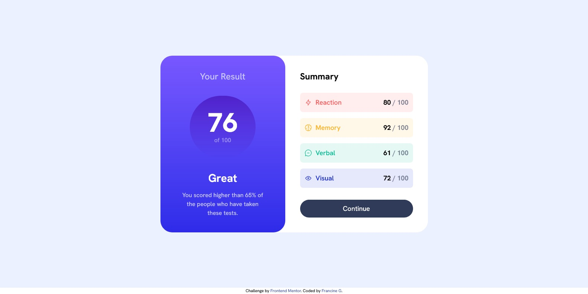
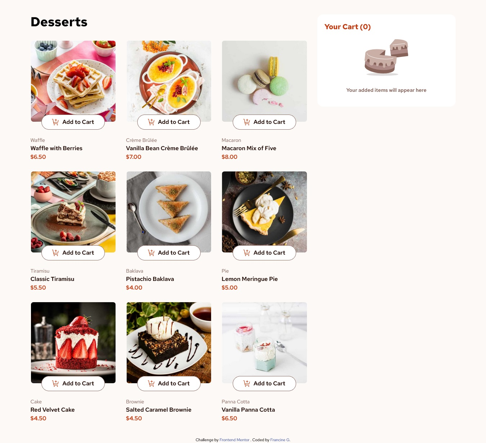
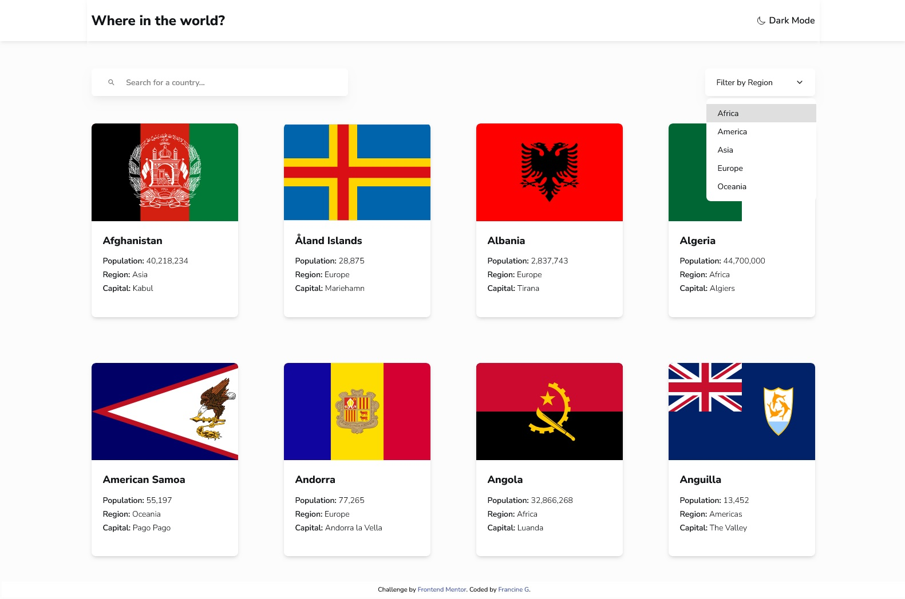

# Projetos Front-end com React

Coleção de projetos front-end utilizando React + Tailwind CSS para praticar

---

### Results summary component challenge on Frontend Mentor

[See repository](https://github.com/francine-godoi/praticando-frontend-com-react/tree/877ac4440fa052bc39b008761b60f4e107e96981/results-summary-component)

---

### Product list with cart challenge on Frontend Mentor

[See repository](https://github.com/francine-godoi/praticando-frontend-com-react/tree/be8c413d173634c3e0e70b4446c862060434b96b/product-list-with-cart)

---

### Mortgage repayment calculator challenge on Frontend Mentor

[See repository](https://github.com/francine-godoi/praticando-frontend-com-react/tree/d1171e78566dc3ad37b746f5b0e60f8bdfc242fd/mortgage-repayment-calculator)

---

### REST Countries API with color theme switcher challenge on Frontend Mentor

[See repository](https://github.com/francine-godoi/praticando-frontend-com-react/tree/7219bc2f2094b0e2aa0ab49534c521b04f10567a/rest-countries-api-with-color-theme-switcher)

