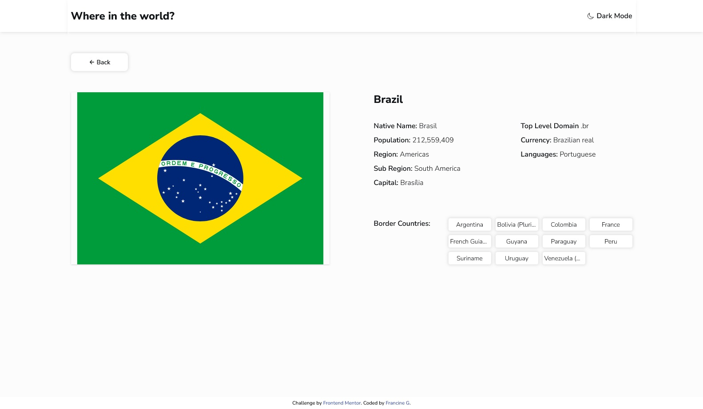

# Frontend Mentor - REST Countries API with color theme switcher solution

This is a solution to the [REST Countries API with color theme switcher challenge on Frontend Mentor](https://www.frontendmentor.io/challenges/rest-countries-api-with-color-theme-switcher-5cacc469fec04111f7b848ca).

## The challenge

Your challenge is to integrate with the [REST Countries API](https://restcountries.com) to pull country data and display it like in the designs.

You can use any JavaScript framework/library on the front-end such as [React](https://reactjs.org) or [Vue](https://vuejs.org). You also have complete control over which packages you use to do things like make HTTP requests or style your project.

Users should be able to:

- See all countries from the API on the homepage
- Search for a country using an `input` field
- Filter countries by region
- Click on a country to see more detailed information on a separate page
- Click through to the border countries on the detail page
- Toggle the color scheme between light and dark mode _(optional)_

**⚠️ NOTE ⚠️: Sometimes the REST Countries API can go down. We've added a `data.json` file with all the country data if you prefer to use that instead. However, please be aware that the data in the JSON file might not be up-to-date.**

### Screenshot

